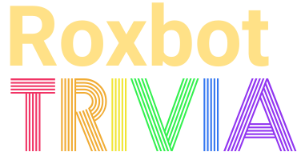

# Roxbot Trivia

## About

Roxbot Trivia is a trivia game in *your* discord server. It's heavily inspired by Tower Unite's Trivia mini-game. Uses the [Open Trivia Database](https://opentdb.com) made by PixelTail Games. To start, just type `;trivia start`.

## How to Play

Once the game has started, questions will be asked and you will be given 20 seconds to answer them. To answer, react with the corrosponding emoji. Roxbot will only accept your first answer. Score is calculated by how quickly you can answer correctly, so make sure to be as quick as possible to win! Person with the most score at the end wins. Glhf!

## How does the game end?

The game ends once all questions have been answered or if everyone has left the game using the `;trivia leave` command.

## Can I have shorter or longer games?

Yes! You can change the length of the game by using the argument `-l or --length` adding short (5 questions), medium (10), or long (15) at the end. `;trivia start --length short`. The default is medium.

## Can I play with friends?

Yes! Trivia is best with friends. How else would friendships come to their untimely demise? You can only join a game during the 20 second waiting period after a game is started. Just type `;trivia join` and you're in! You can leave a game at anytime (even if its just you) by doing `;trivia leave`. If no players are in a game, the game will end and no one will win ;-;

## What if I don't want anyone to join my solo game? Waiting is boring!

No problem! Just put `-s or --solo` anywhere after `;trivia start`

## Can I have a short solo game?

Yes, you can use both arguments at once. The Trivia command takes commands just like a cli. Example: `;tr start -sl short` or `;tr start --solo --length long`

## Disclaimer

Roxbot Trivia uses the Open Trivia Database, made and maintained by Pixeltail Games LLC. The OpenTDB is licensed under the [CC BY-SA 4.0](https://creativecommons.org/licenses/by-sa/4.0/). Find out more at [https://opentdb.com/](https://opentdb.com/).
